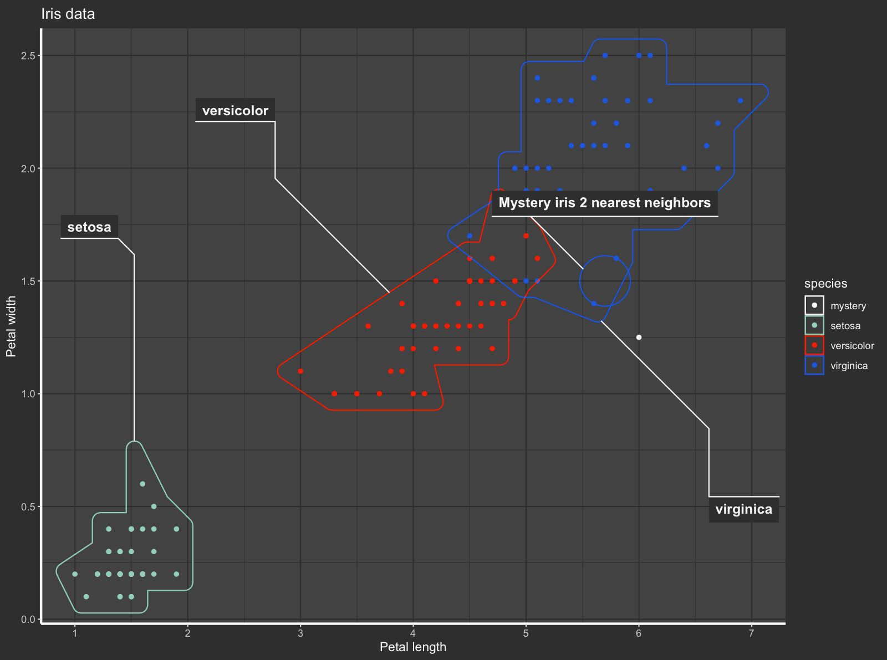

    <h1 style="margin: 20px; padding: 20px;">
        Simple KNN Algorithm (Python, R)
    </h1>

These programs have the same goal: 
- Display on a graph the prescribed data.
- Ask the user if he wants to add more (e.g. he found a plant and would like to know the species)
  - Ask the user for how many neighbors the script should determine the species.

I did this for a school project back in 2020, and I wanted to lean R, so I tried in R.

## R
The user is asked if he wants to add more data (ex: he found an Iris and would like to know the species).

 - If he doens't, the script plots the data.

 - Else, he is asked to enter the data of the new plant and to choose the number of neighbors. The script then plots the data and the new plant and surrounds the neighbors with a circle.

